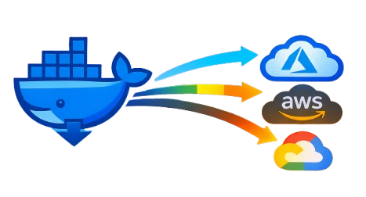

<p align="center">
  
</p>

<h1 align="center">SyncerD</h1>
<p align="center">
  <strong>Your lightweight Docker registry sync engine.</strong>
</p>
<p align="center">
  Sync images from Docker Hub to ECR, ACR, GCR & GHCR — beat rate limits, run anywhere.
</p>

<p align="center">
  <a href="https://github.com/clouddrove/syncerd"></a>
  <a href="https://goreportcard.com/report/github.com/clouddrove/syncerd"></a>
  <a href="https://github.com/clouddrove/syncerd/releases"></a>
  <a href="https://opensource.org/licenses/MIT"></a>
</p>

---

## Why SyncerD?

Docker Hub's [rate limits](https://docs.docker.com/docker-hub/download-rate-limit/) can block pulls in CI and production. **SyncerD** copies images from Docker Hub to your own registries (AWS ECR, Azure ACR, Google GCR, GitHub Container Registry) so you pull from your registry instead — no rate-limit headaches, same images.

- **One config, many registries** — Sync the same set of images to ECR, ACR, GCR, and GHCR from a single YAML.
- **Runs everywhere** — CLI, GitHub Actions, Kubernetes (Helm CronJob). Stateless by default; no DB required.
- **New tags, automatically** — Watches source tags and syncs only what's missing; optional Slack alerts on new syncs or failures.

---

## Table of contents

- [Quick start](#quick-start)
- [Features](#features)
- [Installation](#installation)
- [Usage](#usage)
- [Configuration](#configuration)
- [Contributing & support](#contributing--support)

---

## Quick start

**1. Install** (binary or Go)

```bash
# Binary (see Releases for your OS)
go install github.com/clouddrove/syncerd@latest
```

**2. Add a config** — e.g. `syncerd.yaml`:

```yaml
source:
  type: dockerhub
  registry: docker.io

destinations:
  - name: my-ecr
    type: ecr
    registry: 123456789012.dkr.ecr.us-east-1.amazonaws.com
    region: us-east-1

images:
  - name: library/nginx
    watch_tags: true
```

**3. Run** (use Docker credentials for destinations; [see Auth](#authentication))

```bash
export SYNCERD_SOURCE_USERNAME=your-dockerhub-user
export SYNCERD_SOURCE_PASSWORD=your-dockerhub-token
./syncerd sync --once
```

That's it. Use the same config in [GitHub Actions](#use-as-a-github-action-marketplace) or [Kubernetes (Helm)](#run-with-helm-kubernetes) for scheduled syncs.

---

## Features

| Feature | Description |
|--------|-------------|
| **Multi-registry** | Sync to AWS ECR, Azure ACR, Google GCR, GitHub Container Registry |
| **Auto tag watch** | Detects new tags and syncs only what's missing (optional persistent state) |
| **Scheduled runs** | Built-in cron (e.g. every 3 weeks) or use K8s CronJob / GitHub Actions |
| **GitHub Action** | [Marketplace action](https://github.com/marketplace) — drop into workflows |
| **Helm chart** | Run as a CronJob on Kubernetes; stateless by default (no PVC) |
| **Slack** | Optional notifications on new syncs and failures (compact/detailed) |
| **Secure** | Docker Hub via env/secret; destinations via Docker credential config |

---

## Installation

| Method | Command |
|--------|---------|
| **Go install** | `go install github.com/clouddrove/syncerd@latest` |
| **From source** | `git clone https://github.com/clouddrove/syncerd.git && cd syncerd && go build -o syncerd ./main.go` |
| **Releases** | Download the [latest release](https://github.com/clouddrove/syncerd/releases) for your OS/arch |
| **Docker** | `docker run ghcr.io/clouddrove/syncerd:latest syncerd sync --once` (mount config + auth as needed) |

Requires Go 1.23+ to build from source.

---

## Usage

### Use as a GitHub Action (Marketplace)

Add SyncerD to your workflow:

```yaml
- uses: clouddrove/syncerd@v1
  with:
    config: syncerd.yaml
    once: "true"
```

Add Docker credential steps (e.g. `docker/login-action`, `aws-actions/amazon-ecr-login`) *before* SyncerD so destination registries are authenticated.

### Run with Helm (Kubernetes)

Run SyncerD as a **CronJob** (stateless by default; no PVC):

```bash
helm install syncerd ./_helm/syncerd -n syncerd --create-namespace
```

Set `config.destinations` and `config.images` in `values.yaml` or via `--set`.

**Credentials:**
- Docker Hub (source): use `existingSecret` (recommended) or `secret.*` in values.
- Destination registries (ECR/ACR/GCR/GHCR): create a Docker config secret and set `dockerConfigSecret`. SyncerD automatically sets `DOCKER_CONFIG` so the credentials are found even when the pod runs as a non-root user.
- To pull the SyncerD image itself from a private registry, use `imagePullSecrets` — this is separate from `dockerConfigSecret`.

**ECR note:** ECR tokens expire every 12 hours. Refresh `dockerConfigSecret` before expiry:

```bash
aws ecr get-login-password --region <region> | \
  docker login --username AWS --password-stdin <account>.dkr.ecr.<region>.amazonaws.com

kubectl create secret generic syncerd-docker-config \
  --from-file=.dockerconfigjson=$HOME/.docker/config.json \
  --type=kubernetes.io/dockerconfigjson \
  -n syncerd --dry-run=client -o yaml | kubectl apply -f -
```

See [_helm/syncerd/README.md](_helm/syncerd/README.md) for all chart options.

### Command line

```bash
syncerd sync --once                    # Run once and exit
syncerd sync                           # Run with built-in cron (from config)
syncerd sync --config /path/to/config.yaml
```

---

## Configuration

Full example: [syncerd.yaml.example](syncerd.yaml.example).

| Section | Purpose |
|---------|---------|
| `source` | Docker Hub (username/password or token via env or config) |
| `destinations` | List of registries (ECR, ACR, GCR, GHCR); auth via Docker credential config |
| `images` | Images to sync; optional `tags`, `watch_tags` for new tag detection |
| `schedule` | Cron expression when running without `--once` |
| `state_path` | Optional state file for "already synced" tracking; leave empty for fully stateless |
| `slack` | Optional webhook; notify on new syncs and/or failures |
| `fail_fast` | `true` = stop on first error; `false` = best-effort per image/tag |

### Environment variables

Override with `SYNCERD_` prefix:
`SYNCERD_SOURCE_USERNAME`, `SYNCERD_SOURCE_PASSWORD`, `SYNCERD_SOURCE_TOKEN`,
`SYNCERD_STATE_PATH`, `SYNCERD_SLACK_WEBHOOK_URL`, `SYNCERD_SLACK_CHANNEL`,
`SYNCERD_SLACK_MESSAGE_FORMAT`, `SYNCERD_FAIL_FAST`.

### Authentication

- **Docker Hub (source):** Username/password or Personal Access Token (env or config). Credentials are validated at startup.
- **Destinations (ECR/ACR/GCR/GHCR):** SyncerD uses the default Docker keychain — `docker login`, credential helpers, or GitHub Actions login steps.
- **ECR:** Tokens expire every 12 hours. Ensure credentials are refreshed before each scheduled sync.

---

## Contributing & support

- **Bugs & ideas:** [Open an issue](https://github.com/clouddrove/syncerd/issues).
- **Code:** See [CONTRIBUTING.md](CONTRIBUTING.md). PRs welcome.
- **Star the repo** if SyncerD helps you — it helps others discover the project.

---

## License

[MIT](LICENSE). Built with [go-containerregistry](https://github.com/google/go-containerregistry).
Inspired by the need to work around Docker Hub rate limits.
