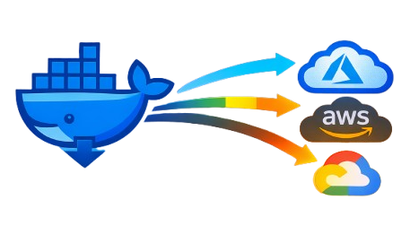

<p align="center">
  
</p>

<h1 align="center">SyncerD</h1>
<p align="center">
  <strong>Your lightweight Docker registry and git repository sync engine.</strong>
</p>
<p align="center">
  Sync images from Docker Hub to ECR, ACR, GCR & GHCR, and mirror git repositories across GitHub, GitLab, Bitbucket, Azure DevOps, and AWS CodeCommit. Beat rate limits, run anywhere.
</p>

<p align="center">
  <a href="https://github.com/clouddrove/syncerd"></a>
  <a href="https://goreportcard.com/report/github.com/clouddrove/syncerd"></a>
  <a href="https://github.com/clouddrove/syncerd/releases"></a>
  <a href="https://opensource.org/licenses/MIT"></a>
  <a href="https://artifacthub.io/packages/helm/syncerd/syncerd"></a>
</p>

---

## Why SyncerD?

Docker Hub's [rate limits](https://docs.docker.com/docker-hub/download-rate-limit/) can block pulls in CI and production. **SyncerD** copies images from Docker Hub to your own registries (AWS ECR, Azure ACR, Google GCR, GitHub Container Registry) so you pull from your registry instead — no rate-limit headaches, same images. SyncerD also mirrors git repositories across GitHub, GitLab, Bitbucket, Azure DevOps, and AWS CodeCommit, so a backup or internal copy of your repos stays in sync on its own schedule.

- **One config, many registries** — Sync the same set of images to ECR, ACR, GCR, and GHCR from a single YAML.
- **Runs everywhere** — CLI, GitHub Actions, Kubernetes (Helm CronJob). Stateless by default; no DB required.
- **New tags, automatically** — Watches source tags and syncs only what's missing; optional branded Slack alerts (color-coded Block Kit) on new syncs or failures.
- **Git mirroring**: Mirror repositories across GitHub, GitLab, Bitbucket, Azure DevOps, and AWS CodeCommit with filtered discovery, safe push modes, and a guard against overwriting a destination that already has content. See [Git mirroring](#git-mirroring).

---

## Table of contents

- [Quick start](#quick-start)
- [Features](#features)
- [Installation](#installation)
- [Usage](#usage)
- [Examples](#examples)
- [Configuration](#configuration)
- [Git mirroring](#git-mirroring)
- [Observability](#observability)
- [Contributing & support](#contributing--support)

---

## Quick start

**1. Install** (binary or Go)

```bash
# Binary (see Releases for your OS)
go install github.com/clouddrove/syncerd@latest
```

**2. Add a config** — e.g. `syncerd.yaml`:

```yaml
source:
  type: dockerhub
  registry: docker.io

destinations:
  - name: my-ecr
    type: ecr
    registry: 123456789012.dkr.ecr.us-east-1.amazonaws.com
    region: us-east-1

images:
  - name: library/nginx
    watch_tags: true
```

**3. Run** (use Docker credentials for destinations; [see Auth](#authentication))

```bash
export SYNCERD_SOURCE_USERNAME=your-dockerhub-user
export SYNCERD_SOURCE_PASSWORD=your-dockerhub-token
./syncerd sync --once
```

That's it. Use the same config in [GitHub Actions](#use-as-a-github-action-marketplace), [Azure DevOps](#azure-devops-pipeline), or [Kubernetes (Helm)](#run-with-helm-kubernetes) for scheduled syncs.

---

## Features

| Feature | Description |
|--------|-------------|
| **Multi-registry** | Sync to AWS ECR, Azure ACR, Google GCR, GitHub Container Registry |
| **Auto tag watch** | Detects new tags and syncs only what's missing (optional persistent state) |
| **Scheduled runs** | Built-in cron (e.g. every 3 weeks) or use K8s CronJob / GitHub Actions |
| **GitHub Action** | [Marketplace action](https://github.com/marketplace) — drop into workflows |
| **Helm chart** | Run as a CronJob on Kubernetes; stateless by default (no PVC) |
| **Slack** | Optional branded Block Kit alerts (color-coded, per-destination grouping) on new syncs and failures (compact/detailed) |
| **Secure** | Docker Hub via env/secret; destinations via Docker credential config, ECR via the AWS credential chain |
| **Git mirroring** | Mirror repositories across GitHub, GitLab, Bitbucket, Azure DevOps, and AWS CodeCommit (`git-sync`); filtered discovery, safe push modes, dry run |

---

## Installation

| Method | Command |
|--------|---------|
| **Go install** | `go install github.com/clouddrove/syncerd@latest` |
| **From source** | `git clone https://github.com/clouddrove/syncerd.git && cd syncerd && go build -o syncerd ./main.go` |
| **Releases** | Download the [latest release](https://github.com/clouddrove/syncerd/releases) for your OS/arch |
| **Docker** | `docker run ghcr.io/clouddrove/syncerd:latest sync --once` (mount config + auth as needed) |

The Docker image is a **multi-arch manifest** supporting `linux/amd64` and `linux/arm64` (AWS Graviton, Apple Silicon).

Requires Go 1.23+ to build from source.

---

## Usage

### Use as a GitHub Action (Marketplace)

Add SyncerD to your workflow:

```yaml
- uses: clouddrove/syncerd@v0.2.2
  with:
    config: syncerd.yaml
    once: "true"
```

Pin to the latest [release tag](https://github.com/clouddrove/syncerd/releases); a floating `v1` tag will exist once the project reaches a 1.0 release.

**Destination registry auth in the Action:**

For **AWS ECR**, add `aws-actions/configure-aws-credentials` before SyncerD and nothing else: SyncerD requests an ECR token itself from the AWS credential chain, so `aws-actions/amazon-ecr-login` is not needed.

```yaml
- uses: aws-actions/configure-aws-credentials@v6
  with:
    role-to-assume: arn:aws:iam::123456789012:role/syncerd
    aws-region: eu-west-1

- uses: clouddrove/syncerd@v0.2.2
  with:
    config: syncerd.yaml
```

For **GHCR, ACR, GCR** (and for ECR if you prefer an explicit `docker login`), the login step has to write its credentials somewhere the Action can read. SyncerD runs as a Docker container action, and a container action does not get the runner's `~/.docker/config.json`, so a plain `docker/login-action` step is invisible to it and every request fails with `401 Unauthorized`. Point `DOCKER_CONFIG` at the workspace, which *is* mounted into the container at `/github/workspace`:

```yaml
env:
  DOCKER_CONFIG: ${{ github.workspace }}/.docker   # job level: where login steps write

steps:
  - uses: docker/login-action@v3
    with:
      registry: ghcr.io
      username: ${{ github.actor }}
      password: ${{ secrets.GITHUB_TOKEN }}

  - uses: clouddrove/syncerd@v0.2.2
    env:
      DOCKER_CONFIG: /github/workspace/.docker     # same directory, path inside the container
    with:
      config: syncerd.yaml
```

**Inputs:**

| Input | Default | Purpose |
|---|---|---|
| `command` | `sync` | Subcommand to run: `sync` or `git-sync` |
| `config` | `syncerd.yaml` | Path to the config file |
| `once` | `true` | Run once and exit instead of the built-in cron |
| `dry-run` | `false` | git-sync only. Report what would be created, pushed, and pruned without writing anything |
| `report` | `""` | Write a machine readable JSON report of the run to this path |
| `metrics-file` | `""` | Write Prometheus textfile collector metrics for the run to this path |
| `log-format` | `text` | `text` or `json` |

**Mirror git repositories instead of images**, set `command: git-sync`. Git provider tokens reach a Docker container action through the step's `env:` block, the same way any other environment variable does, so the tokens must be listed there; there is no separate `with:` input for them. Set each one from a secret, named `SYNCERD_GIT_<PROVIDER_NAME>_TOKEN` (see [Git mirroring](#git-mirroring) for the exact naming rule).

Since the default push mode deletes destination refs that are absent at the source, **run once with `dry-run: "true"` before trusting a new mirror config**:

```yaml
- uses: clouddrove/syncerd@v0.2.2
  with:
    command: git-sync
    config: syncerd.yaml
    once: "true"
    dry-run: "true"
  env:
    SYNCERD_GIT_GH_TOKEN: ${{ secrets.SYNCERD_GH_TOKEN }}
    SYNCERD_GIT_GL_TOKEN: ${{ secrets.SYNCERD_GL_TOKEN }}
```

Once the dry run output looks right, drop `dry-run` (or set it to `"false"`) to let it write for real:

```yaml
- uses: clouddrove/syncerd@v0.2.2
  with:
    command: git-sync
    config: syncerd.yaml
    once: "true"
  env:
    SYNCERD_GIT_GH_TOKEN: ${{ secrets.SYNCERD_GH_TOKEN }}
    SYNCERD_GIT_GL_TOKEN: ${{ secrets.SYNCERD_GL_TOKEN }}
```

### Use as an Azure DevOps Marketplace extension

Install and run SyncerD from Azure Pipelines. The `command` input is passed straight through to the `syncerd` binary, so it works for both subcommands:

```yaml
- task: SyncerD@1
  inputs:
    version: latest
    command: sync --config syncerd.yaml --once=true
```

Add registry authentication steps before this task. SyncerD uses the default Docker keychain, so `docker login`, Azure CLI, and other registry login helpers work as they do on the command line.

To mirror git repositories instead, use `git-sync` and supply provider tokens as secret pipeline variables mapped into `env:` on the task, the same `SYNCERD_GIT_<PROVIDER_NAME>_TOKEN` naming rule as everywhere else in SyncerD:

```yaml
- task: SyncerD@1
  inputs:
    version: latest
    command: git-sync --config syncerd.yaml --once=true --dry-run=true
  env:
    SYNCERD_GIT_GH_TOKEN: $(SYNCERD_GH_TOKEN)
    SYNCERD_GIT_GL_TOKEN: $(SYNCERD_GL_TOKEN)
```

Run once with `--dry-run=true` before trusting a new mirror config; the default push mode deletes destination refs absent at the source. Drop it (or set it to `false`) once the output looks right.

See [azure-devops-extension/examples/azure-devops](azure-devops-extension/examples/azure-devops) for a working ACR smoke-test pipeline, variable group setup, and checked-in config example. Extension source and publishing notes are in [azure-devops-extension/README.md](azure-devops-extension/README.md).

### Run with Helm (Kubernetes)

Run SyncerD as a **CronJob** (stateless by default; no PVC):

```bash
helm install syncerd ./_helm/syncerd -n syncerd --create-namespace
```

Set `config.destinations` and `config.images` in `values.yaml` or via `--set`.

**Credentials:**
- Docker Hub (source): use `existingSecret` (recommended) or `secret.*` in values.
- Destination registries (ACR/GCR/GHCR): create a Docker config secret and set `dockerConfigSecret`. SyncerD automatically sets `DOCKER_CONFIG=/var/lib/syncerd/.docker` so the credentials are found even when the pod runs as a non-root user.
- Destination ECR registries: give the pod AWS credentials instead (IRSA, EKS Pod Identity, or an instance role with `ecr:GetAuthorizationToken` plus push permissions on the target repositories). SyncerD fetches and refreshes the ECR token itself, so no `dockerConfigSecret` and no refresh CronJob is needed.
- To pull the SyncerD image itself from a private registry, use `imagePullSecrets` — this is separate from `dockerConfigSecret`.

**ECR without IAM:** if the pod cannot be given AWS credentials, a Docker config secret still works, but ECR tokens expire every 12 hours and the secret has to be refreshed before expiry:

```bash
aws ecr get-login-password --region <region> | \
  docker login --username AWS --password-stdin <account>.dkr.ecr.<region>.amazonaws.com

kubectl create secret generic syncerd-docker-config \
  --from-file=.dockerconfigjson=$HOME/.docker/config.json \
  --type=kubernetes.io/dockerconfigjson \
  -n syncerd --dry-run=client -o yaml | kubectl apply -f -
```

See [_helm/syncerd/README.md](_helm/syncerd/README.md) for all chart options.

### Command line

```bash
syncerd sync --once                    # Run once and exit
syncerd sync                           # Run with built-in cron (from config)
syncerd sync --config /path/to/config.yaml
```

---

## Examples

| Example | Description |
|---------|-------------|
| [Azure DevOps Pipeline](azure-devops-extension/examples/azure-devops) | Run SyncerD in Azure DevOps and mirror a Docker Hub image into Azure Container Registry. |

---

## Configuration

Full example: [syncerd.yaml.example](syncerd.yaml.example).

| Section | Purpose |
|---------|---------|
| `source` | Docker Hub (username/password or token via env or config) |
| `destinations` | List of registries (ECR, ACR, GCR, GHCR); auth via Docker credential config, or the AWS credential chain for ECR |
| `images` | Images to sync; optional `tags`, `watch_tags` for new tag detection |
| `schedule` | Cron expression when running without `--once` |
| `state_path` | Optional state file for "already synced" tracking; leave empty for fully stateless |
| `slack` | Optional webhook; notify on new syncs and/or failures. Enabled automatically once a webhook URL is set — set `slack.enabled: false` (or `SYNCERD_SLACK_ENABLED=false`) to suppress |
| `fail_fast` | `true` = stop on first error; `false` = best-effort per image/tag |

### Environment variables

Override with `SYNCERD_` prefix:
`SYNCERD_SOURCE_USERNAME`, `SYNCERD_SOURCE_PASSWORD`, `SYNCERD_SOURCE_TOKEN`,
`SYNCERD_STATE_PATH`, `SYNCERD_SLACK_ENABLED`, `SYNCERD_SLACK_WEBHOOK_URL`,
`SYNCERD_SLACK_CHANNEL`, `SYNCERD_SLACK_NOTIFY_ON_NEW`, `SYNCERD_SLACK_NOTIFY_ON_ERROR`,
`SYNCERD_SLACK_MESSAGE_FORMAT`, `SYNCERD_FAIL_FAST`.

### Authentication

- **Docker Hub (source):** Username/password or Personal Access Token (env or config). Credentials are validated at startup.
- **Destinations (ACR/GCR/GHCR):** SyncerD uses the default Docker keychain — `docker login`, credential helpers, or GitHub Actions login steps.
- **ECR:** AWS credentials are enough. When a destination host is a private ECR registry (`<account>.dkr.ecr.<region>.amazonaws.com`), SyncerD calls `ecr:GetAuthorizationToken` through the standard AWS credential chain (environment variables, shared config, IRSA, instance role) and refreshes the token as it expires, so long-running syncs do not need a credential refresh loop. The account and region come from the registry host. A `docker login` for the same registry still takes precedence when one exists. Public ECR (`public.ecr.aws`) is not covered by this and needs a `docker login`.

---

## Git mirroring

`syncerd git-sync` mirrors git repositories between hosting providers, replicating branches, tags, and optionally the heads of open pull requests as a full mirror in either direction. All five provider types are supported: GitHub, GitLab, Bitbucket, Azure DevOps, and AWS CodeCommit, and any of them can be a source or a destination.

**Providers:**

| `type` | What `owner` means | Provider-specific required field |
|---|---|---|
| `github` | Organization (or user) | none |
| `gitlab` | Group | none |
| `bitbucket` | Workspace | `email` (account email; used as the git and API username) |
| `azuredevops` | Organization | `project` (repositories live inside a project) |
| `codecommit` | not applicable; CodeCommit repository names are flat within an account and region | `region` |

**Authentication:**

| Provider | How it authenticates |
|---|---|
| GitHub | Personal access token |
| GitLab | Group access token |
| Bitbucket | API token, with the account email as the username |
| Azure DevOps | Organization-scoped PAT (default), or an Entra ID access token in `entra` mode |
| CodeCommit | IAM (via IRSA, an instance role, or the standard AWS credential chain) for the API; static IAM HTTPS Git credentials for the git transport |

**Minimal config:**

```yaml
git:
  providers:
    - name: gh
      type: github
      owner: your-github-org
    - name: gl
      type: gitlab
      owner: your-gitlab-group

  mirrors:
    - name: gh-to-gl
      source: gh
      destination: gl
      create_missing: true

  work_dir: ./syncerd-git-cache
  state_path: ./syncerd-git-cache/git-state.json
```

A container deployment should point `work_dir` and `state_path` at a mounted volume instead, e.g. `/var/lib/syncerd/git` (see the [Helm chart](_helm/syncerd/README.md#git-mirroring)).

```bash
export SYNCERD_GIT_GH_TOKEN=your-github-token
export SYNCERD_GIT_GL_TOKEN=your-gitlab-token
./syncerd git-sync --once
```

**Tokens:** each provider's token is read from an environment variable named after the provider: the provider name, upper cased, with non alphanumeric characters replaced by underscore. A provider named `gh` reads `SYNCERD_GIT_GH_TOKEN`; a provider named `gh-mirrors` reads `SYNCERD_GIT_GH_MIRRORS_TOKEN`.

**Push modes** (`push_mode` on a mirror, default `mirror`):

| Mode | Behavior |
|------|----------|
| `mirror` | Replicates the source exactly, deleting destination branches and tags absent at source |
| `additive` | Force pushes new and updated refs, never deletes; can still overwrite rewritten history at the destination |
| `fast-forward` | Refuses any non fast-forward update and reports it as a failure |

**Adopt guard:** a mirror refuses to push to a destination that already has content and no prior mirror state, so a misconfigured mirror cannot silently overwrite existing work; set `adopt: true` on the mirror to opt in once you've confirmed the destination is right.

**Pull request heads (opt in):** set `pull_requests.enabled: true` on a mirror and the commits behind each open pull request opened from a **fork** are pushed to the destination as a branch, default `syncerd/pr/<number>`. Without it those commits reach the destination nowhere, since a fork pull request has no branch in the source repository. A pull request opened from a source branch already mirrors under its own name and gets no second copy. The pull request itself is not recreated at the destination yet. Off by default because a fork head is third-party code, and a destination that builds on branch push would run it: read the security note in [docs/git-sync-runbook.md](docs/git-sync-runbook.md#mirroring-pull-request-heads) before enabling it.

**Mirrored pull requests (opt in):** add `pull_requests.mirror_objects: true` and each open source pull request is recreated at the destination as a real pull request, kept in step on every run, with its discussion, inline review comments, and review verdicts. The source is the single authority; nothing written at the destination flows back. A merged source pull request is closed at the destination with a note naming the merge commit, never merged there, because a destination merge would diverge from the mirrored base branch. Review verdicts are mirrored as attributed text rather than real approvals. Mentions and issue references in mirrored text are neutralised so a mirror never notifies or cross links anyone. All five provider types work, in any direction; the runbook has a table of what each one cannot represent (Bitbucket and CodeCommit cannot reopen, neither has labels, CodeCommit has no drafts).

Run with `--dry-run` to print the ref changes each mirror would make, per repository, without creating, pushing, or deleting anything.

**Limitations:**

- **CodeCommit**: SyncerD does not derive SigV4 git credentials, so IRSA and instance roles cover listing and creating repositories but the git transport needs static IAM HTTPS Git credentials, which are only issuable to an IAM user. Set `git_username` and `git_password` on the provider (or `SYNCERD_GIT_<NAME>_GIT_USERNAME` / `SYNCERD_GIT_<NAME>_GIT_PASSWORD`).
- **Azure DevOps Entra mode**: the operator supplies the access token; SyncerD does not acquire one from Azure AD. Set `auth: entra` on the provider and supply the token through the same `SYNCERD_GIT_<NAME>_TOKEN` variable used for a PAT.
- **Bitbucket**: Cloud only. The `api_url` override changes the host but the request paths are Cloud shaped, so Bitbucket Data Center is not supported. Bitbucket also has no archived concept, so `skip_archived` has no effect for a Bitbucket source.
- **CodeCommit filters**: `skip_archived` and `skip_forks` have no effect for CodeCommit sources, since CodeCommit has neither concept.

For the full local test procedure, including config validation, idempotency, pruning, the adopt guard, and Slack, see [docs/git-sync-runbook.md](docs/git-sync-runbook.md).

---

## Observability

Three flags, all opt in and off by default, all shared by `sync` and `git-sync`:

| Flag | What it does |
|------|--------------|
| `--report <path>` | Writes a machine readable JSON summary of the run: counts, per artifact detail, and any failures. One schema across both commands. Written on failed runs too |
| `--metrics-file <path>` | Writes Prometheus [textfile collector](https://github.com/prometheus/node_exporter#textfile-collector) metrics for the run: `syncerd_last_run_unixtime`, `syncerd_last_success_unixtime`, `syncerd_last_run_success`, `syncerd_last_run_duration_seconds`, `syncerd_last_run_items` |
| `--log-format json` | Structured logging. Text remains the default and reproduces the historical output byte for byte, since operators grep it; JSON carries per repository and per run values as real fields |

```bash
syncerd git-sync --once --report /var/lib/syncerd/last-run.json
syncerd sync --once --metrics-file /var/lib/node_exporter/textfile/syncerd-sync.prom
syncerd git-sync --log-format json --once
```

**The staleness alert this exists for:**

```
time() - syncerd_last_success_unixtime{command="git-sync"} > 86400
```

**One metrics file per command.** `--metrics-file` has no lock: two SyncerD processes writing to the same path can race and lose one writer's update, including `syncerd_last_success_unixtime`, which would leave the alert above evaluating over an empty vector and silently not fire. Point `sync` and `git-sync` at two different files, both in a directory node_exporter's textfile collector scrapes, since it merges every `.prom` file in that directory on its own; do not point both commands at one file. `--dry-run` writes no metrics at all, since it created, pushed, and deleted nothing.

---

## Contributing & support

- **Bugs & ideas:** [Open an issue](https://github.com/clouddrove/syncerd/issues).
- **Code:** See [CONTRIBUTING.md](CONTRIBUTING.md). PRs welcome.
- **Star the repo** if SyncerD helps you — it helps others discover the project.

---

## License

[MIT](LICENSE). Built with [go-containerregistry](https://github.com/google/go-containerregistry).
Inspired by the need to work around Docker Hub rate limits.
